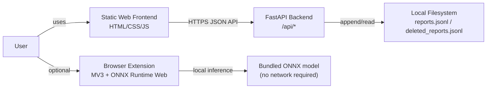
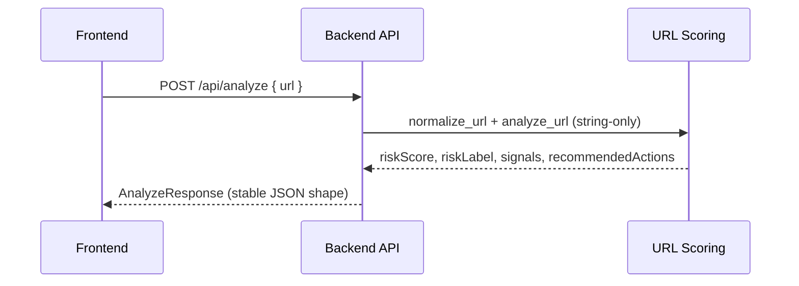
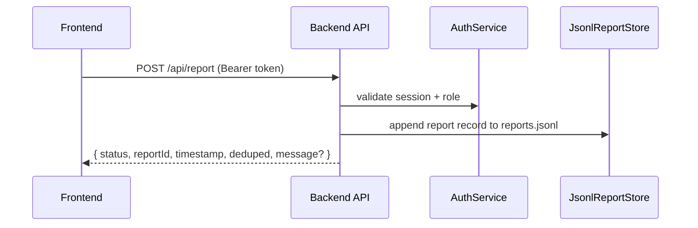

# Antiphish+ — System Architecture

Antiphish+ is a lightweight anti-phishing platform with three main deliverables:

1. **Web app (static frontend)**: scan a URL and submit/view community reports.
2. **Backend API (FastAPI)**: URL-string analysis + reporting feed (no database).
3. **Browser extension (optional)**: on-device “sentry” that blocks/flags suspicious pages.

This document describes the **runtime architecture** (frontend/backend/extension), **data flows**, and the key **security & MVP constraints** (no DB, no SSRF).

---

## Architecture goals (MVP)

- **No database**: persist community reports as append-only JSONL files.
- **No SSRF**: never fetch user-submitted URL content; analyze URL strings only.
- **Stable API response shapes**: frontend depends on predictable JSON fields.
- **Simple deploy**: backend as one FastAPI service; frontend as static hosting.

Non-goals (MVP):
- Distributed rate limiting / multi-instance consistency.
- Long-lived, durable auth accounts (signup is in-memory).
- Automated abuse moderation beyond basic admin delete.

---

## System context

---

## Runtime components

### 1) Static frontend (`/frontend`)

- **Pages**
  - `/` scanner + report submission modal
  - `/feed/` community feed (search/filter/pagination + report detail modal)
- **Configuration**
  - `window.__ANTIPHISH_CONFIG__.API_BASE` in `frontend/config.js` controls the backend base URL.
- **Auth**
  - Stores the backend-issued bearer token client-side and sends it in `Authorization: Bearer ...`.

### 2) Backend API (`/backend`)

Single FastAPI app providing:

- **Auth**: in-memory sessions + in-memory account map (seeded from environment).
- **Analyzer**: deterministic URL-string risk scoring (no network fetch).
- **Reporting**: JSONL append-only storage + read/query + delete-by-admin.
- **Rate limiting**: in-memory limiter for `/api/analyze` and `/api/report`.

Key modules (by responsibility):
- `backend/app/main.py`: routes, middleware, wiring.
- `backend/app/scoring.py`: URL normalization + scoring rules.
- `backend/app/reporting.py`: JSONL report store (read/write/delete).
- `backend/app/auth.py`: signup/login/logout + session TTL (memory only).
- `backend/app/rate_limit.py`: sliding-window in-memory limiter.
- `backend/app/models.py`: Pydantic request/response schemas (stable shapes).

### 3) Browser extension (`/extension`) (optional)

Chrome MV3 service worker that:

- Checks each navigated URL against a small **blacklist/whitelist**.
- Runs **on-device ONNX inference** (via `onnxruntime-web`) to decide if a warning interstitial should be shown.
- Allows “Proceed anyway” once-per-session for a specific URL.

Important: the extension’s model inference is local; it does not require the backend.

### 4) Model training (`/model-training`) (offline)

Offline notebooks/scripts used to train and evaluate phishing models and export artifacts (e.g., the ONNX model bundled into the extension). This pipeline is **not** part of the runtime serving path.

---

## Data storage & lifecycle (no DB)

### Report store format

Backend persists community reports as newline-delimited JSON:

- `backend` writes to `REPORTS_DIR/reports.jsonl`
- Deletions append to `REPORTS_DIR/deleted_reports.jsonl`

At startup, the backend:

1. Loads `deleted_reports.jsonl` into an in-memory set of deleted IDs.
2. Loads `reports.jsonl`, parsing each record and skipping deleted IDs.

### Privacy

- Backend does **not** store raw IP addresses.
- Backend stores `clientIpHash` as a salted SHA-256 hash of client IP (salt via `REPORT_IP_HASH_SALT`).

### Limitations (by design)

- JSONL files are best for single-instance MVPs.
- Auth accounts and sessions are in-memory; **restarts reset**:
  - sessions (logged-in users must log in again),
  - signups created via `/api/auth/signup`.

---

## Key request/response flows

### URL scan (`POST /api/analyze`)

### Community report submission (`POST /api/report`)

### Feed browse (`GET /api/reports`)

- Backend reads from in-memory report list (bootstrapped from JSONL).
- Applies filters (`query`, `reason`, `user`, `since`) and pagination (`page`, `pageSize`).
- Computes `frequency` per `normalizedUrl` across filtered results.

### Admin delete (`DELETE /api/reports/{reportId}`)

- Requires `role=admin`.
- Appends `{reportId}` to `deleted_reports.jsonl` and removes the record from the in-memory list.

---

## Security model

### SSRF avoidance

- The backend never fetches URL content or makes outbound requests to the submitted URL.
- Analysis is based on:
  - URL normalization,
  - simple heuristics (scheme, suspicious TLDs, lookalike domains, encoding patterns, etc.).

### Auth & authorization

- Bearer token stored in-memory on server with an expiry (TTL).
- Role-based authorization:
  - `user`: can submit reports.
  - `admin`: can submit and delete reports.

### Abuse controls

- Per-client IP **in-memory rate limit** for:
  - `/api/analyze`
  - `/api/report`
- Note: if multiple backend instances are used, rate limiting is per-instance.

---

## Deployment topology

Typical production setup:

- **Frontend**: static hosting (Vercel/Netlify/etc.)
  - Serves `frontend/*` directly.
  - Uses `frontend/config.js` to set `API_BASE`.
- **Backend**: one FastAPI service (e.g., Render)
  - Runs `uvicorn app.main:app`
  - Configured with environment variables (CORS, rate limits, report directory, auth seed credentials).

Cross-origin considerations:
- Backend CORS must allow the deployed frontend origin(s) via `CORS_ORIGINS`.

---

## Extension integration (optional)

The browser extension is a separate deliverable:

- Provides proactive protection at browse-time (warning interstitial).
- Does not rely on backend availability.
- Can be extended later to optionally:
  - call `/api/analyze` for additional signals (still must not fetch URL content),
  - let users submit a report directly from the interstitial (with explicit consent + login).

