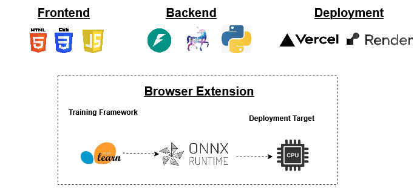

[](https://youtu.be/ygZiG_6mTOE)

# Antiphish+ (Team Agentic Avengers)

Antiphish+ is a digital safety platform that helps users detect suspicious URLs, submit phishing reports, and view a community threat feed.

## Live URLs

- **Live Website:** https://team-agentic-avengers-antiphish.vercel.app
- **Backend (Render):** https://team-agentic-avengers-antiphish.onrender.com
- **API docs:** https://team-agentic-avengers-antiphish.onrender.com/docs

## Tech Stack

---
| Layer    | Technology                          | Hosting  |
|----------|-------------------------------------|----------|
| Frontend | HTML, CSS, JavaScript               | Vercel  |
| Backend  | Python 3.12, FastAPI, Uvicorn       | Render   |
| Data     | File-based (JSONL, no database)     | On disk  |

## Dependencies

### Backend
- `fastapi` — API framework
- `uvicorn[standard]` — ASGI server
- `pydantic` — request/response validation
- `python-dotenv` — environment variable handling
- `pytest` — testing

### Frontend
- No build tools or package managers needed (plain HTML/CSS/JS)

## Run Locally

### 1. Backend

```bash
cd backend
python3 -m venv .venv
source .venv/bin/activate
pip install -r requirements.txt
cp .env.example .env
uvicorn app.main:app --reload --port 8000
```

API docs: [http://127.0.0.1:8000/docs](http://127.0.0.1:8000/docs)

### 2. Frontend

```bash
cd frontend
python3 -m http.server 5173
```

Open in browser:
- Scanner: [http://127.0.0.1:5173/](http://127.0.0.1:5173/)
- Community Feed: [http://127.0.0.1:5173/feed/](http://127.0.0.1:5173/feed/)

## API Endpoints

- `GET /api/health`
- `POST /api/auth/signup`
- `POST /api/auth/login`
- `GET /api/auth/me`
- `POST /api/auth/logout`
- `POST /api/analyze`
- `POST /api/report`
- `GET /api/reports` (filter + pagination)
- `GET /api/reports/{reportId}`
- `DELETE /api/reports/{reportId}` (admin only)

Detailed API docs: [backend/docs/API.md](backend/docs/API.md)

## Architecture

System architecture: [ARCHITECTURE.md](ARCHITECTURE.md)

## Deployment

### Backend (Render)
1. Push this repo to GitHub.
2. In Render, create a new **Web Service** pointing to this repo.
3. Set the **Root Directory** to `backend`.
4. Render reads `render.yaml` and deploys automatically.
5. Set environment variable `CORS_ORIGINS` to include your Netlify frontend URL.

### Frontend (Netlify)
1. In Netlify, import the same GitHub repo.
2. Set **Base directory** to `frontend`.
3. Set **Publish directory** to `frontend`.
4. Deploy.
5. Update `frontend/config.js` to point to your Render backend URL:
   ```js
   window.__ANTIPHISH_CONFIG__ = {
     API_BASE: "https://team-agentic-avengers-antiphish.onrender.com",
   };
   ```

## Tests

```bash
cd backend
source .venv/bin/activate
pytest -q
```
